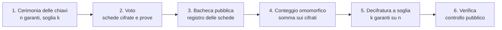

# eVoto — Voto elettronico verificabile

**eVoto** è una libreria Python per sistemi di voto elettronico in cui il voto rimane segreto e il risultato può essere verificato pubblicamente.

Il progetto prende spunto dall'architettura di [ElectionGuard](https://github.com/Election-Tech-Initiative/electionguard-python), ma ne realizza una versione semplificata e didattica. Oggi simula un'elezione politica italiana completa: liste, coalizioni, capolista bloccato, preferenze con vincolo di genere, bacheca pubblica, scrutinio con premio di governabilità ed eletti. L'elezione viene esportata in un registro pubblico JSON, che un verificatore indipendente ricontrolla da solo, passo per passo. Gli esperimenti della tesina misurano il comportamento con garanti assenti e i costi di una scheda, e un notebook didattico ripercorre il protocollo con numeri piccoli. Resta da completare la cabina elettorale web.

> [!WARNING]
> eVoto è un progetto universitario e non è progettato per elezioni reali. I test e gli esempi usano soprattutto un gruppo crittografico didattico di piccole dimensioni; per la demo è disponibile un gruppo da 2048 bit. I principali limiti sono riportati nella sezione [Sicurezza e limiti](#sicurezza-e-limiti).

## Indice

- [Come funziona](#come-funziona)
- [Stato del progetto](#stato-del-progetto)
- [Installazione](#installazione)
- [Guida rapida: referendum sì/no](#guida-rapida-referendum-sìno)
- [Guida rapida: elezione politica](#guida-rapida-elezione-politica)
- [Verificare un'elezione](#verificare-unelezione)
- [Esperimenti](#esperimenti)
- [Notebook didattico](#notebook-didattico)
- [Struttura del repository](#struttura-del-repository)
- [API principali](#api-principali)
- [Test](#test)
- [Sicurezza e limiti](#sicurezza-e-limiti)
- [Sviluppo](#sviluppo)
- [Riferimenti](#riferimenti)
- [Autori](#autori)
- [Licenza](#licenza)

## Come funziona

### Le sei fasi



| Fase | Cosa succede | Modulo |
|---|---|---|
| 1. Cerimonia delle chiavi | `n` garanti generano la chiave pubblica dell'elezione. La chiave segreta viene divisa tra loro e ne bastano `k` per la decifratura. | `garanti.py` |
| 2. Voto | Le caselle della scheda vengono cifrate e accompagnate da prove che ne verificano la validità senza rivelare il contenuto. | `voto.py`, `scheda.py`, `elgamal.py`, `prove.py` |
| 3. Bacheca pubblica | Le schede cifrate vengono inserite in un registro a sola aggiunta; ogni scheda riceve un codice di tracciamento concatenato ai precedenti. | `urna.py` |
| 4. Conteggio omomorfico | I cifrati vengono combinati per ottenere la cifratura della somma dei voti. | `urna.py` |
| 5. Decifratura a soglia | Almeno `k` garanti collaborano alla decifratura del totale e forniscono una prova del proprio contributo. | `decifratura.py` |
| 6. Verifica e scrutinio | Dai totali si calcolano seggi ed eletti; risultato e prove possono essere verificati a partire dai dati pubblici. | `scrutinio.py`, `registro.py`, `verifica/` |

### Primitive crittografiche

Le formule complete sono nella [specifica tecnica](docs/spec_f1.md).

**ElGamal esponenziale.** Il sistema lavora in un gruppo di ordine primo `q`, generato da `g`. Un voto `v` viene cifrato con la chiave pubblica `K` e un valore casuale `r`:

```text
Enc(v) = (alpha, beta) = (g^r mod p,  g^v · K^r mod p)
```

**Omomorfismo.** La moltiplicazione di due cifrati corrisponde alla somma dei valori in chiaro:
`Enc(x) · Enc(y) = Enc(x + y)`.

Il totale viene recuperato da `g^t` tramite un logaritmo discreto limitato. Nel progetto viene utilizzato l'algoritmo baby-step giant-step, adatto a conteggi di dimensione limitata.

**Prove a conoscenza zero.** eVoto utilizza:

- **Schnorr**, per dimostrare la conoscenza di un segreto;
- **Chaum-Pedersen**, per dimostrare che due valori dipendono dallo stesso esponente;
- una prova **OR**, per dimostrare che un cifrato contiene uno dei valori ammessi, ad esempio `0` oppure `1`.

Le prove vengono rese non interattive tramite **Fiat-Shamir**. Nell'hash vengono inclusi il contesto dell'elezione, l'enunciato della prova e i relativi impegni.

**Decifratura a soglia.** Le quote segrete vengono costruite con **Shamir Secret Sharing** e accompagnate da impegni di **Feldman**. Durante lo spoglio, le quote di almeno `k` garanti vengono combinate tramite i **coefficienti di Lagrange**.

### Scheda politica e preferenze

La scheda politica è implementata in `scheda.py`. Le sue regole sono:

| Regola | Vincolo |
|---|---|
| R1 | Ogni casella vale `0` oppure `1`. |
| R2 | La scelta è una sola tra le liste e la scheda bianca. |
| R3 | Le preferenze possono riguardare solo candidati della lista votata. |
| R4 | Le preferenze non superano il massimo fissato nella configurazione (3 nell'esempio). |
| R5 | Le preferenze dello stesso genere non superano il limite fissato nella configurazione (2 nell'esempio). |

Questi vincoli vengono tradotti in prove a conoscenza zero sui valori cifrati. In generale, la verifica richiede di dimostrare che un valore appartiene a un insieme limitato `{0, ..., k}`.

Un punto importante riguarda la segretezza delle preferenze. Se le singole schede venissero decifrate e pubblicate, una combinazione particolare di preferenze potrebbe rendere riconoscibile un voto e facilitare un attacco di tipo *Italian attack*. L'uso del conteggio omomorfico permette invece di decifrare solo i totali necessari allo scrutinio.

### Bacheca e controllo del dispositivo

Prima del deposito il dispositivo mostra l'impronta della scheda cifrata. L'elettore può depositarla oppure sprecarla: una scheda sprecata viene pubblicata insieme ai valori casuali usati per cifrarla, e chiunque può ricifrarla per controllare che il dispositivo abbia cifrato onestamente (sfida di Benaloh). La scheda sprecata non viene contata e l'elettore ne prepara una nuova.

La bacheca rifiuta le schede identiche a una già pubblicata: senza questo controllo si potrebbe ricopiare la scheda di un altro elettore e votare come lui.

### Scrutinio

Lo scrutinio segue una versione semplificata e dichiarata della legge elettorale: soglie di sbarramento per liste e coalizioni, premio di governabilità, riparto con il metodo dei quozienti interi e dei più alti resti, distribuzione dei seggi tra le circoscrizioni ed eletti per capolista e preferenze. Tutti i parametri sono nel file di configurazione, quindi cambiare legge significa cambiare il file e non il codice. Il procedimento completo è nella sezione 46 della [specifica](docs/spec_f1.md).

## Stato del progetto

eVoto è utilizzabile come **libreria Python** e con la demo da riga di comando `demo.py`. La cabina elettorale web è ancora in sviluppo.

| Modulo | Contenuto | Stato |
|---|---|---|
| `evoto/gruppo.py` | Parametri del gruppo, aritmetica modulare e hash canonico `H` | Completato, con il gruppo didattico `TEST_PARAMS` e il gruppo `DEMO_PARAMS` a 2048 bit |
| `evoto/elgamal.py` | ElGamal esponenziale, operazioni omomorfiche e logaritmo discreto limitato | Completato |
| `evoto/prove.py` | Prove di Schnorr, Chaum-Pedersen e OR generica | Completato |
| `evoto/garanti.py` | Cerimonia delle chiavi, Shamir, Feldman e chiave pubblica congiunta | Completato |
| `evoto/decifratura.py` | Decifratura a soglia, Lagrange e prove sulle share | Completato |
| `evoto/scheda.py` | Scheda politica e prove delle regole R1–R5 | Completato; limiti delle preferenze presi dalla configurazione |
| `evoto/configurazione.py` | Lettura della configurazione dell'elezione e layout delle schede | Completato |
| `evoto/voto.py` | Dalla scelta dell'elettore alla scheda cifrata con le prove | Completato |
| `evoto/urna.py` | Bacheca, codici di tracciamento, sfida di Benaloh, aventi diritto, conteggio e decifratura per circoscrizione | Completato |
| `evoto/scrutinio.py` | Soglie, premio, riparto dei seggi, circoscrizioni ed eletti | Completato (modello semplificato) |
| `evoto/simulazione.py` | Elezione simulata confrontata con il conteggio in chiaro | Completato |
| `demo.py` | Elezione simulata da riga di comando (esperimento E1) | Completato |
| `evoto/registro.py` | Registro pubblico dell'elezione in JSON | Completato |
| `verifica/` | Verificatore indipendente | Completato: controlli V1–V8 |
| `esperimenti/` | Esperimenti E2 (garanti assenti) ed E5 (costi) | Completato |
| `cabina/` | Cabina elettorale e bacheca web dimostrative | Da fare |
| `notebook/` | Notebook didattico con numeri piccoli | Completato: esempio della sezione 38 della specifica, controllato dai test |

### Roadmap

- [x] Ambiente, repository e specifica tecnica condivisa
- [x] Nucleo crittografico: gruppo, ElGamal e prove a conoscenza zero
- [x] Test incrociati con ElectionGuard: cifratura (T1), hash (T2), prove 0/1 (T3)
- [x] Cerimonia delle chiavi e decifratura a soglia
- [x] Referendum sì/no completo, dalla cerimonia al risultato
- [x] Scheda politica con le regole R1–R5
- [x] Bacheca pubblica, sfida di Benaloh, scrutinio e riparto dei seggi
- [x] Elezione simulata confrontata con il conteggio in chiaro (esperimento E1)
- [x] Registro pubblico in JSON
- [x] Verificatore indipendente completo (V1–V8), registro manomesso (E3) e client scorretto (E4)
- [x] Test incrociato su un'elezione completa (T4)
- [x] Parametri a 2048 bit per la demo
- [x] Esperimenti E2 (garanti assenti) ed E5 (costi e tempi per scheda)
- [x] Notebook didattico con numeri piccoli
- [ ] Cabina elettorale web e bacheca dimostrativa

## Installazione

### Requisiti

- [Python 3.12](https://www.python.org/downloads/) (versione fissata in `.python-version`)
- [uv](https://docs.astral.sh/uv/getting-started/installation/)
- [Git](https://git-scm.com/)

L'unica dipendenza di esecuzione è [gmpy2](https://pypi.org/project/gmpy2/). `uv` la installa automaticamente.

### Installazione

```bash
git clone https://github.com/Giuse1111/evoto-cryptography.git
cd evoto-cryptography
uv sync
uv run pytest
```

Il repository è privato, quindi è necessario avere l'accesso concesso dagli autori.

I test incrociati con ElectionGuard vengono saltati se il clone di riferimento non è presente. La relativa procedura è descritta nella sezione [Test](#test).

## Guida rapida: referendum sì/no

Il seguente esempio simula un referendum con 5 garanti, soglia 3 e 5 elettori.

Salva il codice in `esempio.py` nella cartella principale del repository ed eseguilo con:

```bash
uv run python esempio.py
```

```python
import secrets

from evoto.decifratura import (
    compute_decryption_share,
    decrypt_tally,
    verify_decryption_share,
)
from evoto.elgamal import encrypt
from evoto.garanti import compute_verification_key, run_key_ceremony
from evoto.gruppo import TEST_PARAMS
from evoto.prove import prove_value_in_set, verify_value_in_set
from evoto.urna import aggregate_ciphertexts

# Gruppo didattico: non utilizzabile in un sistema reale.
params = TEST_PARAMS

# 1. Cerimonia delle chiavi: servono 3 garanti su 5 per la decifratura.
ceremony = run_key_ceremony(
    guardian_count=5,
    quorum=3,
    params=params,
    election_id=1,
)

public_key = ceremony.joint_public_key
context = ceremony.extended_base_hash

# 2. Voto: 1 = sì, 0 = no.
votes = [1, 0, 1, 1, 0]
ballots = []

for vote in votes:
    nonce = secrets.randbelow(params.q - 1) + 1
    ciphertext = encrypt(vote, public_key, params, nonce=nonce)
    proof = prove_value_in_set(
        ciphertext=ciphertext,
        plaintext=vote,
        nonce=nonce,
        allowed_values=(0, 1),
        public_key=public_key,
        params=params,
        context=context,
    )
    ballots.append((ciphertext, proof))

# 3. Verifica delle schede.
for ciphertext, proof in ballots:
    assert verify_value_in_set(
        ciphertext=ciphertext,
        proof=proof,
        allowed_values=(0, 1),
        public_key=public_key,
        params=params,
        context=context,
    )

# 4. Conteggio omomorfico.
tally = aggregate_ciphertexts(
    tuple(ciphertext for ciphertext, _ in ballots),
    params,
)

# 5. Decifratura a soglia con i garanti 1, 3 e 5.
shares = []

for index in (1, 3, 5):
    share = compute_decryption_share(
        guardian_index=index,
        secret_share=ceremony.secret_shares[index],
        tally=tally,
        params=params,
        extended_base_hash=context,
    )

    # 6. Verifica della share del garante.
    verification_key = compute_verification_key(
        index,
        ceremony.records,
        params,
    )

    assert verify_decryption_share(
        share=share,
        verification_key=verification_key,
        tally=tally,
        params=params,
        extended_base_hash=context,
    )
    shares.append(share)

yes = decrypt_tally(
    tally=tally,
    shares=tuple(shares),
    quorum=3,
    params=params,
    max_total=len(votes),
)

print(f"Sì: {yes}   No: {len(votes) - yes}")
```

Output atteso:

```text
Sì: 3   No: 2
```

Nessuna scheda viene decifrata singolarmente: viene decifrato solo il totale. Con due soli garanti la decifratura non è possibile; allo stesso modo, non è possibile costruire la prova per un valore non ammesso come `2`.

## Guida rapida: elezione politica

Il modo più veloce per vedere un'elezione completa è la demo:

```bash
uv run python demo.py
```

La demo usa la configurazione `config/elezione_esempio.json`: tre circoscrizioni, otto liste (sei in due coalizioni e due singole) e 30 seggi. Cento elettori per circoscrizione scelgono a caso lista e preferenze, alcuni sprecano una scheda per controllare il dispositivo, e al termine il risultato cifrato viene confrontato con un conteggio in chiaro delle stesse scelte:

```text
Riparto di 30 seggi
  Coalizione Alfa    141 voti   17 seggi  <- premio
  Coalizione Beta     97 voti    8 seggi
  Lista C             41 voti    4 seggi
  Lista H             15 voti    1 seggio
...
Confronto con il conteggio in chiaro
  totali per circoscrizione: coincidono
  seggi ed eletti:           coincidono
```

| Opzione | Significato | Default |
|---|---|---|
| `--elettori` | elettori per circoscrizione | 100 |
| `--garanti` | numero di garanti | 5 |
| `--quorum` | garanti necessari per decifrare | 3 |
| `--presenti` | garanti presenti allo spoglio | `1,3,5` |
| `--seme` | seme delle scelte casuali degli elettori | 2026 |
| `--config` | file di configurazione | `config/elezione_esempio.json` |

Lo stesso percorso si può seguire con la libreria. Questo esempio vota in una circoscrizione e ne decifra i totali:

```python
from evoto.configurazione import build_ballot_layout, load_election_config
from evoto.garanti import run_key_ceremony
from evoto.gruppo import TEST_PARAMS
from evoto.urna import (
    cast_ballot,
    create_bulletin_board,
    decrypt_district_tally,
    spoil_ballot,
    tally_district,
    verify_board_chain,
)
from evoto.voto import VoterChoice, prepare_ballot

params = TEST_PARAMS
config = load_election_config("config/elezione_esempio.json")

# 1. Cerimonia delle chiavi.
ceremony = run_key_ceremony(
    guardian_count=5,
    quorum=3,
    params=params,
    election_id=config.election_id,
)
public_key = ceremony.joint_public_key
context = ceremony.extended_base_hash

# 2. Circoscrizione Nord: le caselle di preferenza 4 e 5 sono
#    Bruno E. e Costa D. della Lista B (indice 1).
district = 0
layout = build_ballot_layout(config, district)
board = create_bulletin_board(context, params)

choices = [
    VoterChoice(list_index=1, preferences=(4, 5)),   # Lista B e due preferenze
    VoterChoice(list_index=None, preferences=(1,)),  # senza lista: vale per la A
    VoterChoice(list_index=None),                    # scheda bianca
]

for choice in choices:
    prepared = prepare_ballot(
        layout, district, choice, public_key, params, context
    )
    board = cast_ballot(
        board, district, layout, prepared.ballot, prepared.proofs,
        public_key, params,
    )

# 3. Sfida di Benaloh: una scheda sprecata viene pubblicata con i suoi
#    nonce, così chiunque può controllare che il dispositivo cifri onestamente.
challenged = prepare_ballot(
    layout, district, choices[0], public_key, params, context
)
board = spoil_ballot(
    board, district, layout, challenged.ballot, challenged.proofs,
    challenged.witness, public_key, params,
)

assert verify_board_chain(board, params)

# 4-5. Conteggio omomorfico e decifratura a soglia della circoscrizione.
result = decrypt_district_tally(
    tally=tally_district(board, district, layout, params),
    secret_shares=ceremony.secret_shares,
    present_guardians=(1, 3, 5),
    records=ceremony.records,
    quorum=3,
    params=params,
    extended_base_hash=context,
)

print("Voti di lista:  ", result.list_votes)
print("Schede bianche: ", result.blank_votes)
print("Preferenze A, B:", result.preference_votes[:8])
```

Output atteso:

```text
Voti di lista:   (1, 1, 0, 0, 0, 0, 0, 0)
Schede bianche:  1
Preferenze A, B: (0, 1, 0, 0, 1, 1, 0, 0)
```

La scheda sprecata non compare nei totali. Il formato del file di configurazione è descritto nella sezione 42 della [specifica](docs/spec_f1.md).

## Verificare un'elezione

Ogni elezione può essere esportata in un **registro pubblico** in JSON. Il registro contiene solo dati pubblici: configurazione, parametri del gruppo, impegni e prove dei garanti, bacheca completa, totali cifrati, totali in chiaro con le share di decifratura e risultato dello scrutinio. Non contiene mai i segreti dei garanti, la lista degli aventi diritto o i voti in chiaro delle schede depositate.

Il verificatore in `verifica/verifica.py` legge soltanto quel JSON: non importa `evoto` e usa solo la libreria standard di Python e `gmpy2`. In questo modo non condivide codice con chi ha prodotto i dati e può accorgersi dei loro errori.

```python
import json

from evoto.configurazione import load_election_config
from evoto.gruppo import TEST_PARAMS
from evoto.registro import public_registry_to_json
from evoto.simulazione import simulate_election
from verifica.verifica import verify_public_registry

params = TEST_PARAMS
config = load_election_config("config/elezione_esempio.json")

# Elezione simulata: 20 elettori per circoscrizione, spoglio con 3 garanti su 5.
report = simulate_election(
    config=config,
    voters_per_district=20,
    guardian_count=5,
    quorum=3,
    present_guardians=(1, 3, 5),
    params=params,
    seed=1,
)

# Registro pubblico: solo dati pubblici, in JSON.
registry = public_registry_to_json(report, params)

# Il verificatore legge soltanto il JSON e non importa evoto.
print(verify_public_registry(registry))

# Manomissione: un voto in più alla prima lista della prima circoscrizione.
data = json.loads(registry)
data["district_results"][0]["list_votes"][0] += 1

print(verify_public_registry(json.dumps(data)))
```

Output atteso:

```text
{'V1': True, 'V2': True, 'V3': True, 'V4': True, 'V5': True, 'V6': True, 'V7': True, 'V8': True, 'overall': True}
{'V1': True, 'V2': True, 'V3': True, 'V4': True, 'V5': True, 'V6': True, 'V7': False, 'V8': False, 'overall': False}
```

Il voto aggiunto non corrisponde più alla decifratura del totale (V7) e cambia il risultato dello scrutinio (V8).

| Controllo | Cosa verifica |
|---|---|
| V1 | Parametri del gruppo e chiave pubblica |
| V2 | Contesto `Q`, prove di Schnorr dei garanti, chiave pubblica congiunta e `Q_bar` |
| V3 | Prove R1–R5 di ogni scheda, con i limiti presi dalla configurazione |
| V4 | Catena dei codici di tracciamento, schede sprecate ricifrate, assenza di copie |
| V5 | Totali cifrati ricalcolati dalle sole schede depositate |
| V6 | Chiavi di verifica dei garanti, prove sulle share di decifratura, quorum |
| V7 | Totali in chiaro compatibili con i totali cifrati: `B / M = g^t` |
| V8 | Scrutinio rifatto da zero: soglie, premio, seggi ed eletti |

## Esperimenti

| Esperimento | Cosa mostra | Dove |
|---|---|---|
| E1 | Elezione simulata: voti, premio, seggi ed eletti coincidono con un conteggio in chiaro | `demo.py`, `test/test_elezione.py` |
| E2 | Garanti assenti: qualunque gruppo di 3 garanti su 5 decifra lo stesso risultato; meno di 3 share non rivelano nulla | `esperimenti/e2_garanti_assenti.py` |
| E3 | Registro manomesso: il verificatore indica quale controllo fallisce | `test/test_elezione.py`, `test/test_verifica.py` |
| E4 | Client scorretto: una scheda che viola R3–R5 non ha prove valide | `test/test_scheda.py`, `test/test_verifica.py` |
| E5 | Costi: dimensione e tempi per scheda al variare di liste e candidati, proiezione su una circoscrizione | `esperimenti/e5_costi.py` |

Gli esperimenti si eseguono dalla radice del repository. Le formule e le scelte di misura sono nella sezione 50 della [specifica](docs/spec_f1.md).

### E2: garanti assenti

```bash
uv run python -m esperimenti.e2_garanti_assenti
uv run python -m esperimenti.e2_garanti_assenti --gruppo demo --elettori 10
```

Si esegue una sola elezione simulata (la stessa di `demo.py`), poi i suoi totali cifrati vengono decifrati con ognuno dei 16 gruppi di almeno 3 garanti su 5. Ogni volta si confronta il risultato con il conteggio in chiaro e si passa il registro al verificatore indipendente. Con 2 soli garanti la decifratura viene rifiutata.

La seconda parte lavora nel gruppo didattico, dove `q = 1289` è abbastanza piccolo da enumerare tutti i polinomi: per ogni possibile segreto conta quanti polinomi passano per le share note.

```text
16 gruppi su 16 danno lo stesso risultato del conteggio in chiaro.
Con 2 garanti la decifratura è rifiutata in 10 casi su 10.

  Share note        Segreti compatibili   Polinomi per segreto
  {1}                1289 su 1289        1289
  {1, 2}             1289 su 1289        1
  {1, 2, 3}             1 su 1289        1
```

Con una o due share tutti i 1289 segreti restano ugualmente possibili; con tre il segreto è determinato e coincide con quello della chiave pubblica (`g^s = K`). Gli impegni di Feldman pubblicano `K = g^s`, quindi nel sistema completo la segretezza diventa computazionale: ricavare `s` richiede un logaritmo discreto.

### E5: costi di una scheda

```bash
uv run python -m esperimenti.e5_costi
uv run python -m esperimenti.e5_costi --python-puro --csv misure_e5.csv
uv run python -m esperimenti.e5_costi --liste 2,10 --candidati 8 --ripetizioni 1
```

Ogni misura cifra e verifica schede vere con `prepare_ballot` e `verify_ballot`; le esponenziazioni modulari vengono contate durante l'esecuzione. La scheda di riferimento ha 10 liste, ciascuna con capolista e 8 candidati: 91 cifrati, 175 prove e 353 rami delle prove OR. Valori indicativi, misurati su un portatile: su un'altra macchina cambiano i tempi, non le dimensioni né il numero di esponenziazioni.

| Configurazione | Dimensione | Cifratura | Verifica |
|---|---|---|---|
| `p` da 4096 bit, con gli impegni delle prove, Python puro | 0,48 MB | 27 s | 39 s |
| `p` da 4096 bit, forma compatta, `gmpy2` | 0,12 MB | 1,5 s | 2,0 s |
| `p` da 2048 bit e `q` da 256 bit, forma compatta, `gmpy2` | 0,07 MB | 0,4 s | 0,6 s |

Nella forma compatta le prove contengono solo sfide e risposte, perché gli impegni si ricalcolano; il nostro registro pubblica anche gli impegni (0,25 MB a 2048 bit). Le dimensioni coincidono con le stime della proposta di progetto. La verifica esegue circa 3.000 esponenziazioni, contro le circa 1.000 della stima, e 1.231 di queste controllano che ogni elemento ricevuto appartenga al sottogruppo (`x^q = 1`). `gmpy2` è da 8 a 20 volte più veloce di `pow()`, a seconda della macchina.

Su una circoscrizione di un milione di elettori, con il gruppo da 2048 bit, la bacheca occupa circa 70 GB in forma compatta e la verifica di tutte le schede richiede circa 165 ore su un core. Le schede si verificano in modo indipendente, quindi il lavoro si divide tra più core. Il conteggio omomorfico richiede circa 45 minuti, la decifratura di tutti i totali pochi secondi: il costo è dominato dalla verifica delle singole schede.

## Notebook didattico

`notebook/demo_didattica.ipynb` ripercorre il protocollo con il gruppo didattico (`p = 2579`, `q = 1289`, `g = 4`) e l'esempio della sezione 38 della [specifica](docs/spec_f1.md): tre garanti con quorum 2, tre elettori che votano `1, 0, 1`. Ogni valore è calcolato dalla libreria e confrontato con quello della specifica.

| Sezione | Contenuto |
|---|---|
| 1–2 | Il gruppo di ordine primo e perché `g = 2` fa trapelare il voto (Mosca 2019) |
| 3–4 | ElGamal esponenziale e conteggio omomorfico: `(A, B) = (1196, 154)`, `t = 2` |
| 5 | Shamir con un dealer e coefficienti di Lagrange, con un garante assente |
| 6 | Cerimonia delle chiavi senza dealer: impegni di Feldman, prove di Schnorr, `K = 530` |
| 7 | Decifratura a soglia con le prove di Chaum-Pedersen; una share sola non rivela nulla |
| 8 | Una prova OR costruita a mano e accettata dalla libreria |
| 9 | Una scheda politica con due liste e le prove R1–R5 |
| 10 | Bacheca, codici di tracciamento e sfida di Benaloh |
| 11 | Un'elezione completa verificata dal verificatore indipendente, poi manomessa |

Jupyter non è una dipendenza del progetto: `uv` lo scarica in un ambiente temporaneo.

```bash
uv run --with jupyter jupyter lab notebook/demo_didattica.ipynb
```

Su GitHub il notebook si legge già con le uscite. Il test `test/test_notebook.py` ne esegue tutte le celle con il solo interprete Python, quindi ogni modifica alla libreria che cambia un valore dell'esempio fa fallire i test.

## Struttura del repository

```text
evoto-cryptography/
├── evoto/                      # la libreria
│   ├── gruppo.py               # parametri del gruppo, aritmetica modulare, hash H
│   ├── elgamal.py              # ElGamal esponenziale e operazioni omomorfiche
│   ├── prove.py                # prove a conoscenza zero
│   ├── garanti.py              # cerimonia delle chiavi
│   ├── decifratura.py          # decifratura a soglia
│   ├── scheda.py               # scheda politica e regole R1-R5
│   ├── configurazione.py       # configurazione dell'elezione
│   ├── voto.py                 # dispositivo di voto
│   ├── urna.py                 # bacheca, conteggio e spoglio per circoscrizione
│   ├── scrutinio.py            # seggi ed eletti
│   └── simulazione.py          # elezione simulata (esperimento E1)
├── verifica/
│   └── verifica.py             # verificatore indipendente V1-V8 (non importa evoto)
├── esperimenti/
│   ├── e2_garanti_assenti.py   # esperimento E2: garanti assenti
│   └── e5_costi.py             # esperimento E5: dimensione e tempi per scheda
├── config/
│   └── elezione_esempio.json   # liste, coalizioni, candidati, soglie, premio
├── notebook/
│   └── demo_didattica.ipynb    # il protocollo a numeri piccoli
├── test/                       # test unitari, di integrazione e incrociati
├── docs/
│   └── spec_f1.md              # specifica tecnica condivisa
├── demo.py                     # elezione simulata da riga di comando
├── pyproject.toml              # metadati e dipendenze
├── uv.lock                     # versioni esatte delle dipendenze
└── .python-version             # versione di Python usata dal progetto
```

La cartella `riferimento/`, usata per i test con ElectionGuard, non fa parte del repository.

## API principali

Tutte le funzioni ricevono esplicitamente i parametri del gruppo (`params`) e lavorano con interi Python. Il nonce può essere passato manualmente per riprodurre i vettori della specifica nei test.

### `evoto.gruppo`

| Nome | Descrizione |
|---|---|
| `GroupParameters(p, q, g)` | Parametri del gruppo di ordine primo `q` |
| `TEST_PARAMS` | Gruppo didattico `p = 2579`, `q = 1289`, `g = 4` |
| `DEMO_PARAMS` | Gruppo per la demo: `p` da 2048 bit, sottogruppo di ordine `q` da 256 bit (RFC 5114) |
| `mod_pow`, `mod_inverse` | Esponenziazione e inverso modulari |
| `validate_group_parameters` | Verifica dei parametri `p`, `q`, `g` |
| `is_subgroup_element` | Verifica dell'appartenenza al sottogruppo |
| `H(*values, params)` | Hash canonico SHA-256 ridotto modulo `q` |

### `evoto.elgamal`

| Nome | Descrizione |
|---|---|
| `Ciphertext(alpha, beta)` | Cifrato ElGamal |
| `generate_secret_key`, `public_key_from_secret` | Generazione delle chiavi |
| `encrypt(message, public_key, params, nonce=None)` | Cifratura esponenziale |
| `multiply_ciphertexts`, `divide_ciphertexts` | Somma e differenza dei valori cifrati |
| `bounded_discrete_log(value, params, max_exponent)` | Logaritmo discreto limitato |

### `evoto.prove`

| Nome | Descrizione |
|---|---|
| `prove_schnorr`, `verify_schnorr` | Dimostrazione della conoscenza di `x` con `Y = g^x` |
| `prove_chaum_pedersen`, `verify_chaum_pedersen` | Dimostrazione dello stesso esponente in due relazioni |
| `prove_value_in_set`, `verify_value_in_set` | Verifica che il cifrato contenga un valore ammesso |

### `evoto.garanti`

| Nome | Descrizione |
|---|---|
| `run_key_ceremony(guardian_count, quorum, params, election_id)` | Esegue la cerimonia delle chiavi con garanti simulati |
| `KeyCeremony` | Dati pubblici della cerimonia e share segrete dei garanti simulati |
| `create_guardian`, `create_guardian_record`, `verify_guardian_record` | Creazione e verifica dei garanti |
| `compute_share`, `verify_share`, `aggregate_shares` | Share di Shamir e verifica di Feldman |
| `compute_joint_public_key`, `compute_verification_key` | Chiave pubblica dell'elezione e chiavi di verifica |
| `compute_base_hash`, `compute_extended_base_hash` | Contesti `Q` e `Q_bar` |

### `evoto.decifratura`

| Nome | Descrizione |
|---|---|
| `compute_decryption_share`, `verify_decryption_share` | Contributo di un garante alla decifratura e relativa prova |
| `lagrange_coefficient` | Coefficiente di Lagrange valutato in zero |
| `combine_decryption_shares` | Combina le share dei garanti |
| `decrypt_tally(tally, shares, quorum, params, max_total)` | Restituisce il totale in chiaro |

### `evoto.scheda`

| Nome | Descrizione |
|---|---|
| `BallotLayout`, `PreferenceMetadata` | Struttura pubblica della scheda: liste, lista e genere di ogni preferenza, limiti delle preferenze |
| `EncryptedBallot`, `BallotWitness`, `BallotProofs` | Scheda cifrata, dati privati del votante, prove R1–R5 |
| `prove_ballot`, `verify_ballot` | Prove complete di una scheda e loro verifica |

### `evoto.configurazione`

| Nome | Descrizione |
|---|---|
| `load_election_config(path)` | Legge e valida il file JSON dell'elezione |
| `build_ballot_layout(config, district_index)` | Layout della scheda di una circoscrizione |
| `preference_candidates(config, district_index)` | Candidato di ogni casella di preferenza |

### `evoto.voto`

| Nome | Descrizione |
|---|---|
| `VoterChoice(list_index, preferences)` | Scelta dell'elettore; senza lista né preferenze è una scheda bianca |
| `prepare_ballot(layout, district_index, choice, public_key, params, extended_base_hash)` | Scheda cifrata con prove, impronta e dati per un'eventuale sfida |

### `evoto.urna`

| Nome | Descrizione |
|---|---|
| `create_bulletin_board`, `cast_ballot`, `spoil_ballot` | Bacheca, deposito e scheda sprecata |
| `verify_board_chain`, `find_entry` | Controllo della catena dei codici e ricerca del proprio codice |
| `create_voter_roll`, `cast_voter_ballot` | Aventi diritto e deposito con controllo del voto unico |
| `tally_district`, `decrypt_district_tally` | Totali cifrati e decifratura di una circoscrizione |
| `aggregate_ciphertexts(ciphertexts, params)` | Aggrega i cifrati di un insieme di schede |

### `evoto.scrutinio`

| Nome | Descrizione |
|---|---|
| `run_scrutiny(config, results)` | Soglie, premio, seggi ed eletti a partire dai totali |
| `largest_remainder(votes, seats)` | Metodo dei quozienti interi e dei più alti resti |

### `evoto.simulazione`

| Nome | Descrizione |
|---|---|
| `simulate_election(...)` | Elezione completa con elettori simulati e confronto con il conteggio in chiaro; il resoconto contiene anche i totali cifrati di ogni circoscrizione |

### `evoto.registro`

| Nome | Descrizione |
|---|---|
| `build_public_registry(report, params)` | Dati pubblici dell'elezione come dizionario serializzabile |
| `public_registry_to_json(report, params)` | Registro pubblico in formato JSON |

### `verifica.verifica`

Verificatore indipendente: non importa `evoto` e rifà i controlli con la sola libreria standard e `gmpy2`.

| Nome | Descrizione |
|---|---|
| `verify_public_registry(json)` | Esegue V1–V8 sul registro e restituisce l'esito di ogni controllo e quello complessivo (`overall`) |
| `parse_public_registry(json)` | Legge e controlla la struttura del registro |

## Test

```bash
uv run pytest
uv run pytest test/test_garanti.py
uv run pytest -v
```

I test comprendono:

- test unitari per i singoli moduli, inclusi casi di manomissione e input non validi;
- test di integrazione del referendum, dalla cerimonia delle chiavi al risultato;
- test di integrazione di un'elezione politica completa (`test_elezione.py`), confrontata con il conteggio in chiaro;
- test del registro pubblico (`test_registro.py`) e del verificatore indipendente (`test_verifica.py`), comprese le manomissioni mirate dell'esperimento E3 e i client scorretti dell'esperimento E4;
- un test completo con i parametri a 2048 bit, dalla simulazione al registro fino alla verifica V1–V8;
- test degli esperimenti E2 ed E5 (`test_esperimento_e2.py`, `test_esperimento_e5.py`), con i casi piccoli calcolati a mano;
- l'esecuzione di tutte le celle del notebook didattico (`test_notebook.py`);
- test incrociati con ElectionGuard per verificare la compatibilità di cifratura, hash, prove 0/1 e totali di un'elezione.

### Test con ElectionGuard

Per eseguirli serve un clone locale di ElectionGuard nella cartella `riferimento/`:

```bash
git clone https://github.com/Election-Tech-Initiative/electionguard-python.git riferimento
cd riferimento
uv venv -p 3.12 .venv
uv pip install -p .venv/bin/python -e . hypothesis pytest gmpy2
cd ..
uv run pytest test/test_cross_electionguard.py -v
```

Su Windows il percorso dell'interprete è `.venv\Scripts\python.exe`.

I test controllano in particolare:

| Test | Cosa controlla |
|---|---|
| T1 | Con stessa chiave e nonce, i cifrati coincidono con quelli di ElectionGuard |
| T2 | L'hash `H` produce gli stessi valori di `hash_elems` |
| T3 | Le implementazioni accettano reciprocamente le prove 0/1 |
| T4 | Sugli stessi voti e nonce, i totali cifrati coincidono con quelli di ElectionGuard e il totale decifrato con il conteggio in chiaro |

ElectionGuard viene usato solo come riferimento per i test: la libreria `evoto` non lo importa e non ne dipende.

## Sicurezza e limiti

eVoto è un progetto didattico e non deve essere considerato pronto per un uso reale.

- **Parametri crittografici.** `TEST_PARAMS` è volutamente piccolo e serve solo per test ed esempi. `DEMO_PARAMS` usa un gruppo da 2048 bit con sottogruppo da 256 bit (RFC 5114): poiché `(p - 1) / q` ha fattori piccoli, ogni elemento ricevuto viene controllato con `is_subgroup_element`.
- **Garanti simulati.** I garanti sono gestiti nello stesso programma e le share passano in memoria. In un sistema reale dovrebbero essere entità separate, con dispositivi e canali protetti. Di conseguenza, `KeyCeremony.secret_shares` contiene attualmente tutte le share insieme.
- **Gestione degli errori nella cerimonia.** Una share non valida interrompe la cerimonia invece di portare all'esclusione del garante.
- **Scrutinio semplificato.** Il riparto segue le regole principali ma non tutte quelle della legge vera: per esempio il numero di seggi di ogni circoscrizione non è fissato in anticipo e i pareggi si risolvono con regole semplici e dichiarate.
- **Schede sprecate.** Una scheda sprecata è pubblica per costruzione: serve solo a controllare il dispositivo e non viene mai contata.
- **Modello di avversario.** La generazione congiunta della chiave con Feldman considera garanti *honest-but-curious*; un garante attivamente disonesto può influenzare in parte la distribuzione della chiave pubblica.
- **Aspetti non implementati.** Restano fuori dallo scope la sicurezza della rete e dell'interfaccia web, l'identificazione reale degli elettori, la resistenza alla coercizione nel voto da remoto e la completa aderenza giuridica del riparto dei seggi.
- **Minaccia quantistica.** La sicurezza si basa sul problema del logaritmo discreto, che non è resistente a un computer quantistico sufficientemente potente.

## Sviluppo

La [specifica tecnica condivisa](docs/spec_f1.md) definisce formule, formati e interfacce. Le modifiche a questi elementi devono essere riportate nella specifica prima dell'implementazione.

Convenzioni del progetto:

- nomi dei moduli in italiano; identificatori di funzioni, classi e variabili in inglese;
- docstring, commenti e messaggi di errore in italiano;
- ogni funzione crittografica ha test dedicati, compresi casi di manomissione;
- niente librerie esterne per le primitive che il progetto richiede di implementare.

`main` deve rimanere stabile. Le modifiche vengono sviluppate su branch `feature/...`, `fix/...` o `docs/...` e integrate tramite pull request quando i test passano e la specifica è rispettata; le modifiche alle parti condivise vanno comunicate all'altro autore.

## Riferimenti

- [ElectionGuard](https://github.com/Election-Tech-Initiative/electionguard-python), implementazione di riferimento (licenza MIT)
- T. ElGamal, *A public key cryptosystem and a signature scheme based on discrete logarithms*, IEEE Transactions on Information Theory, 1985
- A. Shamir, *How to share a secret*, Communications of the ACM, 1979
- P. Feldman, *A practical scheme for non-interactive verifiable secret sharing*, FOCS 1987
- C. P. Schnorr, *Efficient signature generation by smart cards*, Journal of Cryptology, 1991
- D. Chaum, T. P. Pedersen, *Wallet databases with observers*, CRYPTO 1992
- R. Cramer, I. Damgård, B. Schoenmakers, *Proofs of partial knowledge and simplified design of witness hiding protocols*, CRYPTO 1994
- R. Cramer, R. Gennaro, B. Schoenmakers, *A secure and optimally efficient multi-authority election scheme*, EUROCRYPT 1997
- J. Benaloh, *Simple verifiable elections*, EVT 2006
- B. Adida, *Helios: Web-based open-audit voting*, USENIX Security 2008
- V. Cortier, B. Smyth, *Attacking and fixing Helios: an analysis of ballot secrecy*, IEEE CSF 2011
- D. Bernhard, O. Pereira, B. Warinschi, *How not to prove yourself: pitfalls of the Fiat-Shamir heuristic and applications to Helios*, ASIACRYPT 2012
- R. Gennaro, S. Jarecki, H. Krawczyk, T. Rabin, *Secure distributed key generation for discrete-log based cryptosystems*, EUROCRYPT 1999

## Autori

- **Giuseppe Corasaniti** — nucleo crittografico, scheda politica, verificatore
- **Matteo Rabbia** — garanti, decifratura a soglia, urna e scrutinio, cabina e notebook

Progetto per il corso di Crittografia della Laurea Magistrale in Sicurezza Informatica, Università degli Studi di Milano, a.a. 2025/26.

## Licenza

eVoto è distribuito con licenza [Apache 2.0](LICENSE). Le informazioni su copyright e attribuzioni sono nel file [NOTICE](NOTICE).
