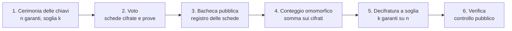

# eVoto — Voto elettronico verificabile

**eVoto** è una libreria Python per sistemi di voto elettronico in cui il voto rimane segreto e il risultato può essere verificato pubblicamente.

Il progetto prende spunto dall'architettura di [ElectionGuard](https://github.com/Election-Tech-Initiative/electionguard-python), ma ne realizza una versione semplificata e didattica. L'obiettivo è arrivare a una simulazione di un'elezione politica italiana con liste, coalizioni, capolista bloccato e fino a tre preferenze con vincolo di genere.

> [!WARNING]
> eVoto è un progetto universitario e non è progettato per elezioni reali. Al momento utilizza un gruppo crittografico didattico di piccole dimensioni. I principali limiti sono riportati nella sezione [Sicurezza e limiti](#sicurezza-e-limiti).

## Indice

- [Come funziona](#come-funziona)
- [Stato del progetto](#stato-del-progetto)
- [Installazione](#installazione)
- [Guida rapida: referendum sì/no](#guida-rapida-referendum-sìno)
- [Struttura del repository](#struttura-del-repository)
- [API principali](#api-principali)
- [Test](#test)
- [Sicurezza e limiti](#sicurezza-e-limiti)
- [Sviluppo](#sviluppo)
- [Riferimenti](#riferimenti)
- [Autori](#autori)

## Come funziona

### Le sei fasi



| Fase | Cosa succede | Modulo |
|---|---|---|
| 1. Cerimonia delle chiavi | `n` garanti generano la chiave pubblica dell'elezione. La chiave segreta viene divisa tra loro e ne bastano `k` per la decifratura. | `garanti.py` |
| 2. Voto | Le caselle della scheda vengono cifrate e accompagnate da prove che ne verificano la validità senza rivelare il contenuto. | `elgamal.py`, `prove.py` |
| 3. Bacheca pubblica | Le schede cifrate vengono inserite in un registro a sola aggiunta, con un codice di tracciamento associato a ogni elettore. | `urna.py` (in sviluppo) |
| 4. Conteggio omomorfico | I cifrati vengono combinati per ottenere la cifratura della somma dei voti. | `urna.py` |
| 5. Decifratura a soglia | Almeno `k` garanti collaborano alla decifratura del totale e forniscono una prova del proprio contributo. | `decifratura.py` |
| 6. Verifica | Il risultato e le prove possono essere verificati a partire dai dati pubblici. | `verifica/` (previsto) |

### Primitive crittografiche

Le formule complete sono nella [specifica tecnica](docs/spec_f1.md).

**ElGamal esponenziale.** Il sistema lavora in un gruppo di ordine primo `q`, generato da `g`. Un voto `v` viene cifrato con la chiave pubblica `K` e un valore casuale `r`:

```text
Enc(v) = (alpha, beta) = (g^r mod p,  g^v · K^r mod p)
```

**Omomorfismo.** La moltiplicazione di due cifrati corrisponde alla somma dei valori in chiaro:
`Enc(x) · Enc(y) = Enc(x + y)`.

Il totale viene recuperato da `g^t` tramite un logaritmo discreto limitato. Nel progetto viene utilizzato l'algoritmo baby-step giant-step, adatto a conteggi di dimensione limitata.

**Prove a conoscenza zero.** eVoto utilizza:

- **Schnorr**, per dimostrare la conoscenza di un segreto;
- **Chaum-Pedersen**, per dimostrare che due valori dipendono dallo stesso esponente;
- una prova **OR**, per dimostrare che un cifrato contiene uno dei valori ammessi, ad esempio `0` oppure `1`.

Le prove vengono rese non interattive tramite **Fiat-Shamir**. Nell'hash vengono inclusi il contesto dell'elezione, l'enunciato della prova e i relativi impegni.

**Decifratura a soglia.** Le quote segrete vengono costruite con **Shamir Secret Sharing** e accompagnate da impegni di **Feldman**. Durante lo spoglio, le quote di almeno `k` garanti vengono combinate tramite i **coefficienti di Lagrange**.

### Scheda politica e preferenze

La parte relativa alle elezioni politiche è ancora in sviluppo. Le regole previste sono:

| Regola | Vincolo |
|---|---|
| R1 | Ogni casella vale `0` oppure `1`. |
| R2 | La scelta è una sola tra le liste e la scheda bianca. |
| R3 | Le preferenze possono riguardare solo candidati della lista votata. |
| R4 | Sono ammesse al massimo tre preferenze. |
| R5 | Si applica un vincolo di genere alle preferenze. |

Questi vincoli vengono tradotti in prove a conoscenza zero sui valori cifrati. In generale, la verifica richiede di dimostrare che un valore appartiene a un insieme limitato `{0, ..., k}`.

Un punto importante riguarda la segretezza delle preferenze. Se le singole schede venissero decifrate e pubblicate, una combinazione particolare di preferenze potrebbe rendere riconoscibile un voto e facilitare un attacco di tipo *Italian attack*. L'uso del conteggio omomorfico permette invece di decifrare solo i totali necessari allo scrutinio.

## Stato del progetto

Attualmente eVoto è utilizzabile come **libreria Python**. La demo da riga di comando e la cabina elettorale web sono ancora in sviluppo.

| Modulo | Contenuto | Stato |
|---|---|---|
| `evoto/gruppo.py` | Parametri del gruppo, aritmetica modulare e hash canonico `H` | Completato; mancano i parametri a 2048 bit |
| `evoto/elgamal.py` | ElGamal esponenziale, operazioni omomorfiche e logaritmo discreto limitato | Completato |
| `evoto/prove.py` | Prove di Schnorr, Chaum-Pedersen e OR generica | Completato |
| `evoto/garanti.py` | Cerimonia delle chiavi, Shamir, Feldman e chiave pubblica congiunta | Completato |
| `evoto/decifratura.py` | Decifratura a soglia, Lagrange e prove sulle share | Completato |
| `evoto/urna.py` | Aggregazione omomorfica dei cifrati | Parziale: mancano bacheca, codici di tracciamento e cast-or-spoil |
| `evoto/scheda.py` | Scheda politica e prove delle regole R1–R5 | Da fare |
| `evoto/scrutinio.py` | Coalizioni, soglie, premio, riparto dei seggi ed eletti | Da fare |
| `evoto/registro.py` | Lettura e scrittura del registro pubblico in JSON | Da fare |
| `verifica/` | Verificatore indipendente | Da fare |
| `cabina/` | Cabina elettorale e bacheca web dimostrative | Da fare |
| `notebook/` | Notebook didattico con numeri piccoli | Da fare |

### Roadmap

- [x] Ambiente, repository e specifica tecnica condivisa
- [x] Nucleo crittografico: gruppo, ElGamal e prove a conoscenza zero
- [x] Test incrociati con ElectionGuard: cifratura (T1), hash (T2), prove 0/1 (T3)
- [x] Cerimonia delle chiavi e decifratura a soglia
- [x] Referendum sì/no completo, dalla cerimonia al risultato
- [ ] Scheda politica con le regole R1–R5
- [ ] Bacheca pubblica, scrutinio e riparto dei seggi
- [ ] Verificatore indipendente e test di manomissione
- [ ] Test incrociato su un'elezione completa (T4)
- [ ] Cabina elettorale web, notebook didattico e misure delle prestazioni

## Installazione

### Requisiti

- [Python 3.12](https://www.python.org/downloads/) (versione fissata in `.python-version`)
- [uv](https://docs.astral.sh/uv/getting-started/installation/)
- [Git](https://git-scm.com/)

L'unica dipendenza di esecuzione è [gmpy2](https://pypi.org/project/gmpy2/). `uv` la installa automaticamente.

### Installazione

```bash
git clone https://github.com/Giuse1111/evoto-cryptography.git
cd evoto-cryptography
uv sync
uv run pytest
```

Il repository è privato, quindi è necessario avere l'accesso concesso dagli autori.

I test incrociati con ElectionGuard vengono saltati se il clone di riferimento non è presente. La relativa procedura è descritta nella sezione [Test](#test).

## Guida rapida: referendum sì/no

Il seguente esempio simula un referendum con 5 garanti, soglia 3 e 5 elettori.

Salva il codice in `esempio.py` nella cartella principale del repository ed eseguilo con:

```bash
uv run python esempio.py
```

```python
import secrets

from evoto.decifratura import (
    compute_decryption_share,
    decrypt_tally,
    verify_decryption_share,
)
from evoto.elgamal import encrypt
from evoto.garanti import compute_verification_key, run_key_ceremony
from evoto.gruppo import TEST_PARAMS
from evoto.prove import prove_value_in_set, verify_value_in_set
from evoto.urna import aggregate_ciphertexts

# Gruppo didattico: non utilizzabile in un sistema reale.
params = TEST_PARAMS

# 1. Cerimonia delle chiavi: servono 3 garanti su 5 per la decifratura.
ceremony = run_key_ceremony(
    guardian_count=5,
    quorum=3,
    params=params,
    election_id=1,
)

public_key = ceremony.joint_public_key
context = ceremony.extended_base_hash

# 2. Voto: 1 = sì, 0 = no.
votes = [1, 0, 1, 1, 0]
ballots = []

for vote in votes:
    nonce = secrets.randbelow(params.q - 1) + 1
    ciphertext = encrypt(vote, public_key, params, nonce=nonce)
    proof = prove_value_in_set(
        ciphertext=ciphertext,
        plaintext=vote,
        nonce=nonce,
        allowed_values=(0, 1),
        public_key=public_key,
        params=params,
        context=context,
    )
    ballots.append((ciphertext, proof))

# 3. Verifica delle schede.
for ciphertext, proof in ballots:
    assert verify_value_in_set(
        ciphertext=ciphertext,
        proof=proof,
        allowed_values=(0, 1),
        public_key=public_key,
        params=params,
        context=context,
    )

# 4. Conteggio omomorfico.
tally = aggregate_ciphertexts(
    tuple(ciphertext for ciphertext, _ in ballots),
    params,
)

# 5. Decifratura a soglia con i garanti 1, 3 e 5.
shares = []

for index in (1, 3, 5):
    share = compute_decryption_share(
        guardian_index=index,
        secret_share=ceremony.secret_shares[index],
        tally=tally,
        params=params,
        extended_base_hash=context,
    )

    # 6. Verifica della share del garante.
    verification_key = compute_verification_key(
        index,
        ceremony.records,
        params,
    )

    assert verify_decryption_share(
        share=share,
        verification_key=verification_key,
        tally=tally,
        params=params,
        extended_base_hash=context,
    )
    shares.append(share)

yes = decrypt_tally(
    tally=tally,
    shares=tuple(shares),
    quorum=3,
    params=params,
    max_total=len(votes),
)

print(f"Sì: {yes}   No: {len(votes) - yes}")
```

Output atteso:

```text
Sì: 3   No: 2
```

Nessuna scheda viene decifrata singolarmente: viene decifrato solo il totale. Con due soli garanti la decifratura non è possibile; allo stesso modo, non è possibile costruire la prova per un valore non ammesso come `2`.

## Struttura del repository

```text
evoto-cryptography/
├── evoto/                      # la libreria
│   ├── gruppo.py               # parametri del gruppo, aritmetica modulare, hash H
│   ├── elgamal.py              # ElGamal esponenziale e operazioni omomorfiche
│   ├── prove.py                # prove a conoscenza zero
│   ├── garanti.py              # cerimonia delle chiavi
│   ├── decifratura.py          # decifratura a soglia
│   └── urna.py                 # conteggio omomorfico
├── test/                       # test unitari, di integrazione e incrociati
├── docs/
│   └── spec_f1.md              # specifica tecnica condivisa
├── demo.py                     # elezione simulata da riga di comando (in sviluppo)
├── pyproject.toml              # metadati e dipendenze
├── uv.lock                     # versioni esatte delle dipendenze
└── .python-version             # versione di Python usata dal progetto
```

La cartella `riferimento/`, usata per i test con ElectionGuard, non fa parte del repository.

## API principali

Tutte le funzioni ricevono esplicitamente i parametri del gruppo (`params`) e lavorano con interi Python. Il nonce può essere passato manualmente per riprodurre i vettori della specifica nei test.

### `evoto.gruppo`

| Nome | Descrizione |
|---|---|
| `GroupParameters(p, q, g)` | Parametri del gruppo di ordine primo `q` |
| `TEST_PARAMS` | Gruppo didattico `p = 2579`, `q = 1289`, `g = 4` |
| `mod_pow`, `mod_inverse` | Esponenziazione e inverso modulari |
| `validate_group_parameters` | Verifica dei parametri `p`, `q`, `g` |
| `is_subgroup_element` | Verifica dell'appartenenza al sottogruppo |
| `H(*values, params)` | Hash canonico SHA-256 ridotto modulo `q` |

### `evoto.elgamal`

| Nome | Descrizione |
|---|---|
| `Ciphertext(alpha, beta)` | Cifrato ElGamal |
| `generate_secret_key`, `public_key_from_secret` | Generazione delle chiavi |
| `encrypt(message, public_key, params, nonce=None)` | Cifratura esponenziale |
| `multiply_ciphertexts`, `divide_ciphertexts` | Somma e differenza dei valori cifrati |
| `bounded_discrete_log(value, params, max_exponent)` | Logaritmo discreto limitato |

### `evoto.prove`

| Nome | Descrizione |
|---|---|
| `prove_schnorr`, `verify_schnorr` | Dimostrazione della conoscenza di `x` con `Y = g^x` |
| `prove_chaum_pedersen`, `verify_chaum_pedersen` | Dimostrazione dello stesso esponente in due relazioni |
| `prove_value_in_set`, `verify_value_in_set` | Verifica che il cifrato contenga un valore ammesso |

### `evoto.garanti`

| Nome | Descrizione |
|---|---|
| `run_key_ceremony(guardian_count, quorum, params, election_id)` | Esegue la cerimonia delle chiavi con garanti simulati |
| `KeyCeremony` | Dati pubblici della cerimonia e share segrete dei garanti simulati |
| `create_guardian`, `create_guardian_record`, `verify_guardian_record` | Creazione e verifica dei garanti |
| `compute_share`, `verify_share`, `aggregate_shares` | Share di Shamir e verifica di Feldman |
| `compute_joint_public_key`, `compute_verification_key` | Chiave pubblica dell'elezione e chiavi di verifica |
| `compute_base_hash`, `compute_extended_base_hash` | Contesti `Q` e `Q_bar` |

### `evoto.decifratura`

| Nome | Descrizione |
|---|---|
| `compute_decryption_share`, `verify_decryption_share` | Contributo di un garante alla decifratura e relativa prova |
| `lagrange_coefficient` | Coefficiente di Lagrange valutato in zero |
| `combine_decryption_shares` | Combina le share dei garanti |
| `decrypt_tally(tally, shares, quorum, params, max_total)` | Restituisce il totale in chiaro |

### `evoto.urna`

| Nome | Descrizione |
|---|---|
| `aggregate_ciphertexts(ciphertexts, params)` | Aggrega i cifrati di un insieme di schede |

## Test

```bash
uv run pytest
uv run pytest test/test_garanti.py
uv run pytest -v
```

I test comprendono:

- test unitari per i singoli moduli, inclusi casi di manomissione e input non validi;
- test di integrazione del referendum, dalla cerimonia delle chiavi al risultato;
- test incrociati con ElectionGuard per verificare la compatibilità di cifratura, hash e prove 0/1.

### Test con ElectionGuard

Per eseguirli serve un clone locale di ElectionGuard nella cartella `riferimento/`:

```bash
git clone https://github.com/Election-Tech-Initiative/electionguard-python.git riferimento
cd riferimento
uv venv -p 3.12 .venv
uv pip install -p .venv/bin/python -e . hypothesis pytest gmpy2
cd ..
uv run pytest test/test_cross_electionguard.py -v
```

Su Windows il percorso dell'interprete è `.venv\\Scripts\\python.exe`.

I test controllano in particolare:

| Test | Cosa controlla |
|---|---|
| T1 | Con stessa chiave e nonce, i cifrati coincidono con quelli di ElectionGuard |
| T2 | L'hash `H` produce gli stessi valori di `hash_elems` |
| T3 | Le implementazioni accettano reciprocamente le prove 0/1 |

ElectionGuard viene usato solo come riferimento per i test: la libreria `evoto` non lo importa e non ne dipende.

## Sicurezza e limiti

eVoto è un progetto didattico e non deve essere considerato pronto per un uso reale.

- **Parametri crittografici.** È disponibile solo `TEST_PARAMS`, volutamente piccolo. I parametri previsti a 2048 bit con sottogruppo da 256 bit non sono ancora inclusi.
- **Garanti simulati.** I garanti sono gestiti nello stesso programma e le share passano in memoria. In un sistema reale dovrebbero essere entità separate, con dispositivi e canali protetti. Di conseguenza, `KeyCeremony.secret_shares` contiene attualmente tutte le share insieme.
- **Gestione degli errori nella cerimonia.** Una share non valida interrompe la cerimonia invece di portare all'esclusione del garante.
- **Modello di avversario.** La generazione congiunta della chiave con Feldman considera garanti *honest-but-curious*; un garante attivamente disonesto può influenzare in parte la distribuzione della chiave pubblica.
- **Aspetti non implementati.** Restano fuori dallo scope la sicurezza della rete e dell'interfaccia web, l'identificazione reale degli elettori, la resistenza alla coercizione nel voto da remoto e la completa aderenza giuridica del riparto dei seggi.
- **Minaccia quantistica.** La sicurezza si basa sul problema del logaritmo discreto, che non è resistente a un computer quantistico sufficientemente potente.

## Sviluppo

La [specifica tecnica condivisa](docs/spec_f1.md) definisce formule, formati e interfacce. Le modifiche a questi elementi devono essere riportate nella specifica prima dell'implementazione.

Convenzioni del progetto:

- nomi dei moduli in italiano; identificatori di funzioni, classi e variabili in inglese;
- docstring, commenti e messaggi di errore in italiano;
- ogni funzione crittografica ha test dedicati, compresi casi di manomissione;
- niente librerie esterne per le primitive che il progetto richiede di implementare.

`main` deve rimanere stabile. Le modifiche vengono sviluppate su branch `feature/...`, `fix/...` o `docs/...` e integrate tramite pull request dopo la revisione dell'altro autore.

## Riferimenti

- [ElectionGuard](https://github.com/Election-Tech-Initiative/electionguard-python), implementazione di riferimento (licenza MIT)
- T. ElGamal, *A public key cryptosystem and a signature scheme based on discrete logarithms*, IEEE Transactions on Information Theory, 1985
- A. Shamir, *How to share a secret*, Communications of the ACM, 1979
- P. Feldman, *A practical scheme for non-interactive verifiable secret sharing*, FOCS 1987
- C. P. Schnorr, *Efficient signature generation by smart cards*, Journal of Cryptology, 1991
- D. Chaum, T. P. Pedersen, *Wallet databases with observers*, CRYPTO 1992
- R. Cramer, I. Damgård, B. Schoenmakers, *Proofs of partial knowledge and simplified design of witness hiding protocols*, CRYPTO 1994
- R. Cramer, R. Gennaro, B. Schoenmakers, *A secure and optimally efficient multi-authority election scheme*, EUROCRYPT 1997
- B. Adida, *Helios: Web-based open-audit voting*, USENIX Security 2008
- D. Bernhard, O. Pereira, B. Warinschi, *How not to prove yourself: pitfalls of the Fiat-Shamir heuristic and applications to Helios*, ASIACRYPT 2012
- R. Gennaro, S. Jarecki, H. Krawczyk, T. Rabin, *Secure distributed key generation for discrete-log based cryptosystems*, EUROCRYPT 1999

## Autori

- **Giuseppe Corasaniti** — nucleo crittografico, scheda politica, verificatore
- **Matteo Rabbia** — garanti, decifratura a soglia, urna e scrutinio, cabina e notebook

Progetto per il corso di Crittografia della Laurea Magistrale in Sicurezza Informatica, Università degli Studi di Milano, a.a. 2025/26.
